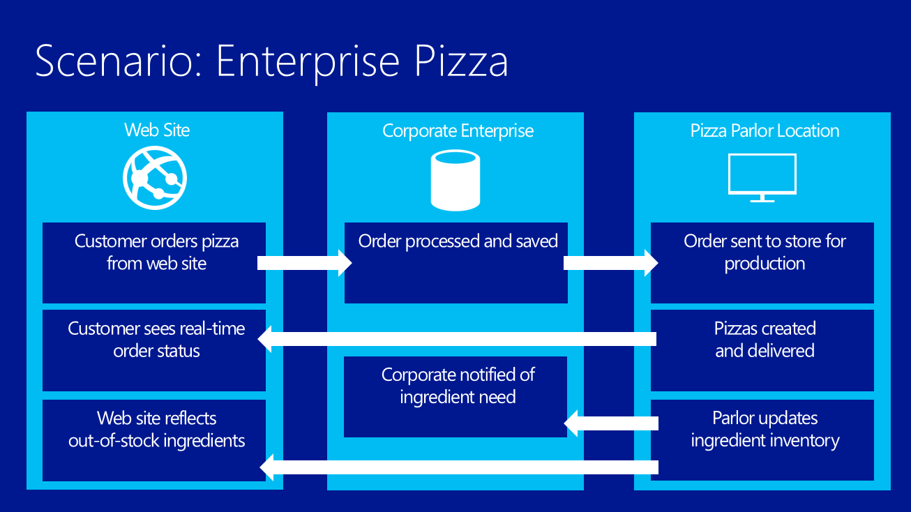

Enterprise Pizza
=================
This repository contains the deck and demos for Brady Gaster's Build session, [Create Connected Business Applications with Windows Azure Websites](http://channel9.msdn.com/Events/Build/2013/3-553). The example is of Enterprise Pizza, a fictitious pizza company, and building their pizza-ordering site atop Web Sites. Their site will need to tie into their stores and to their corporate network, so that inventory and order data can be shared across locations. 

This solution is demonstrated using Windows Azure Web Sites and the Windows Azure Service Bus, along with 2 custom applications that make use of Service Bus Topics and Relays to distribute the conversation. 

## Storyline ##

The demos build the site's story, which the diagram below demonstrates at a high level. 

Some of the details of the storyline are listed below. 

1. Site, domain project, and data-access project for persisting data to the database
1. Orders sent to corporate office application via a Service Bus Topic
1. Orders saved to corporate database using EF/DAL functionality
1. Orders sent to store using Service Bus Topics so the orders can be displayed on a monitor application
1. Inventory service hosted in web site and in corporate app that is called by the internal monitor application when store workers want to update the inventory
1. Order status service hosted in web site that provides real-time order status to the customer as the store creates and ships the pizza 